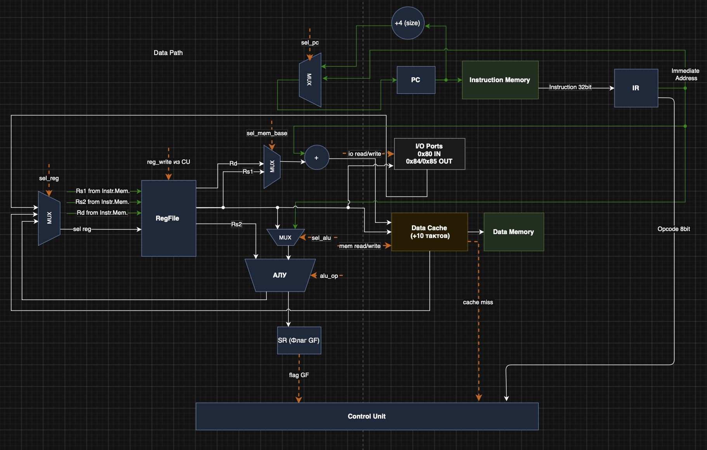
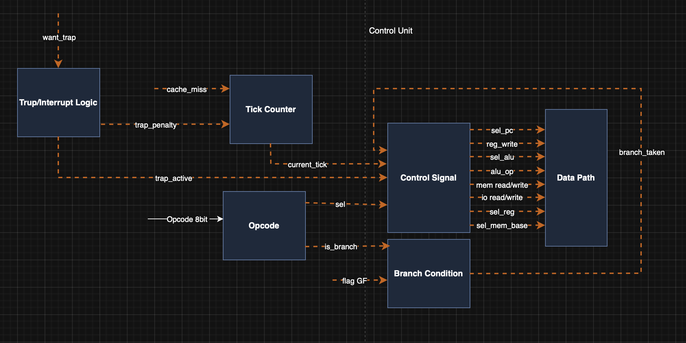

# Лабораторная работа №4. Архитектура компьютера.
- **ФИО:** Горелова Ульяна
- **Группа:** P3222
- **Вариант:** `alg | risc | harv | hw | tick | binary | trap | port | pstr | prob2 | cache`
---
## Вариант
| Задание | Вариант | Описание |
| :--- | :--- | :--- |
| **Язык программирования** | `alg` | JS-подобный синтаксис. Поддержка переменных, циклов `for`, условий `if` и математических выражений с приоритетами. |
| **Архитектура** | `risc` | Load/Store архитектура. Операции выполняются только над регистрами. Доступ к памяти — через `LW` и `SW`. |
| **Организация памяти** | `harv` | Гарвардская архитектура: раздельные хранилища для команд и данных. |
| **Control Unit** | `hw` | Hardwired. Устройство управления реализовано как часть программной модели. |
| **Точность модели** | `tick` | Потактовое моделирование. Логирование состояния процессора на каждом шаге. |
| **Представление кода** | `binary` | Бинарное представление. Машинный код упакован в 32-битные слова. |
| **Ввод-вывод** | `trap` | Прерывания. Обработка внешних событий по расписанию (тики/значения). |
| **Ввод-вывод ISA** | `port` | Port-mapped I/O. Специальные команды `IN` (0x80) и `OUT` (0x84/0x85). |
| **Тип строк** | `pstr` | Pascal Strings: первый байт-длина, далее - символы. |
| **Алгоритм** | `prob2` | Sum Square Difference (Euler Problem 6). |
| **Усложнение** | `cache` | Реализация L1 Кэша данных со штрафом 10 тактов за промах (miss). |
---
## Язык программирования
### Синтаксис (EBNF)
```ebnf
program ::= { statement }

statement ::= assignment | for_loop | while_loop | if_statement | print_call | read_call

assignment ::= identifier "=" expression ";"

for_loop ::= "for" "(" identifier "=" expression "," expression "," expression ")" "{" { statement } "}"

while_loop ::= "while" "(" expression cmp_op expression ")" "{" { statement } "}"

if_statement ::= "if" "(" expression cmp_op expression ")" "{" { statement } "}" [ "else" "{" { statement } "}" ]

print_call ::= "print" "(" expression ")" ";"

read_call ::= "read" "(" ")"

expression ::= term { ("+" | "-") term }

term ::= factor { ("*" | "/") factor }

factor ::= identifier | number | string | "(" expression ")" | "read()"

cmp_op ::= ">" | "<" | "==" | "!="

identifier ::= [a-zA-Z_][a-zA-Z0-9_]*

number ::= [0-9]+

string ::= '"' { any_character } '"'
```
---
### Семантика

1) Типизация: Строгая типизация отсутствует. Основной тип — знаковое 32-битное целое число. Строки поддерживаются в формате Pascal Strings.

2) Области видимости: Глобальная область видимости для всех переменных. Переменная создаётся автоматически при первом присваивании и размещается в памяти данных по фиксированному адресу (начиная со 100-го слова).

3) Приоритет операций: Реализован через иерархию AST. Умножение (*) и деление (/) имеют более высокий приоритет, чем сложение (+) и вычитание (-). Порядок может быть изменён скобками ().

4) Управляющие конструкции:
* for (init, limit, step): Цикл выполняется, пока счетчик не превысит limit
* while (cond): Цикл выполняется, пока условие истинно.
* if-else: Стандартное ветвление. Блок else является необязательным.

5) Строковые литералы: Строка "text" автоматически преобразуется в структуру в памяти данных: первое слово — длина (4), следующие слова — ASCII-коды символов. При передаче строки в print(), транслятор помечает её специальным типом вывода (порт 0x85).
---
## Организация памяти
**Модель памяти**

Процессор использует Гарвардскую архитектуру:

1) Instruction Memory: Память команд. Содержит 32-битные инструкции. Размер — 1024 слова. Доступ только по чтению.

2) Data Memory: Память данных. Линейное адресное пространство. Машинное слово — 32 бита.

3) L1 Cache: Кэш данных.

* Размер: 4 записи.

* Логика: FIFO (First-In, First-Out).

* Задержки: Hit — 1 такт, Miss — 11 тактов. Кэшируются только операции LW и SW.

**Регистры**
1) R0: Жёстко зафиксирован в 0. Запись в R0 игнорируется.
2) R1-R12: Регистры общего назначения для вычислений и временного хранения.
3) R13: Stack Pointer (SP) используется для сохранения адреса возврата при прерываниях.
4) R14: Link Register (RA) хранит PC на момент входа в Trap.
5) R15: Program Counter (PC) адрес текущей инструкции в памяти команд.
---
### Система команд (ISA)
Инструкция имеет фиксированную длину 32 бита: [Opcode:8][Rd:4][Rs1:4][Imm:16].
### Набор инструкций

| Мнемоника | Опкод | Описание | Семантика |
| :--- | :--- | :--- | :--- |
| **ADD** | 0x01 | Сложение | `regs[rd] = regs[rs1] + regs[imm]` |
| **SUB** | 0x02 | Вычитание | `regs[rd] = regs[rs1] - regs[imm]` |
| **MUL** | 0x03 | Умножение | `regs[rd] = regs[rs1] * regs[imm]` |
| **DIV** | 0x04 | Деление | `regs[rd] = regs[rs1] / regs[imm]` |
| **LW**  | 0x05 | Загрузка слова | `regs[rd] = mem[regs[rs1] + imm]` (через Кэш) |
| **SW**  | 0x06 | Сохранение слова | `mem[regs[rd] + imm] = regs[rs1]` (через Кэш) |
| **LI**  | 0x07 | Загрузка константы | `regs[rd] = imm` |
| **CMP** | 0x08 | Сравнение | `gf = (regs[rs1] > regs[imm]); zf = (regs[rs1] == regs[imm])` |
| **JMP** | 0x09 | Безусловный переход | `PC = imm` |
| **BEQ** | 0x0A | Переход если "равно" | `if (zf) PC = imm` |
| **BNE** | 0x0B | Переход если "не равно" | `if (!zf) PC = imm` |
| **BGT** | 0x0C | Переход если "больше" | `if (gf) PC = imm` |
| **IN**  | 0x0D | Ввод из порта | `regs[rd] = trap_val` (чтение значения из прерывания) |
| **OUT** | 0x0E | Вывод в порт | `port[imm] = regs[rs1]` (0x84 - числа, 0x85 - строки) |
| **IRET**| 0x10 | Возврат из Trap | `PC = pc_saved; in_isr = false` |
| **HALT**| 0xFF | Остановка | Прекращение работы процессора |

---
### Транслятор
Транслятор (translator.py) выполняет:
1) Лексический анализ (токенизация).
2) Синтаксический анализ (построение AST).
3) Генерацию бинарного кода и начального снимка памяти (.mem).
---
**Пример AST (для solution.alg)**
```text
|-- ASSIGN: a
  |-- NUMBER: 0
|-- ASSIGN: b
  |-- NUMBER: 0
|-- ASSIGN: limit
  |-- NUMBER: 100
|-- FOR: i
  |-- NUMBER: 1
  |-- VAR: limit
  |-- NUMBER: 1
  |-- ASSIGN: a
    |-- BIN_OP: +
      |-- VAR: a
      |-- BIN_OP: *
        |-- VAR: i
        |-- VAR: i
  |-- ASSIGN: b
    |-- BIN_OP: +
      |-- VAR: b
      |-- VAR: i
|-- ASSIGN: res
  |-- BIN_OP: -
    |-- BIN_OP: *
      |-- VAR: b
      |-- VAR: b
    |-- VAR: a
|-- PRINT
  |-- VAR: res
```
---
## Модель процессора
Процессор реализует классическую RISC-архитектуру с раздельной памятью команд и данных (Harvard) и встроенным L1 Кэшем для данных.
### Схемы
#### DataPath

#### Control Unit

---
### Описание ключевых блоков
#### Тракт данных (DataPath)
* **PC (Program Counter)**: Регистр, хранящий адрес текущей инструкции в Instruction Memory.
* **+4 (size)**: Инкрементатор адреса PC для перехода к следующей команде.
* **Instruction Memory**: Память команд (Harvard), содержащая бинарный код.
* **IR (Instruction Register)**: Буферный регистр, удерживающий текущую 32-битную инструкцию.
* **RegFile**: Регистровый файл (R0-R15). R0 жёстко зафиксирован в 0. Содержит три порта чтения (Rd, Rs1, Rs2) и один порт записи.
* **ALU (АЛУ)**: Вычислительный блок (трапеция), выполняющий арифметику и сравнение.
* **SR (Флаг GF)**: Регистр состояния, хранящий флаг "Больше" (Greater Flag) для условий.
* **Address Adder (+)**: Сумматор для вычисления эффективного адреса памяти данных (Rd + Imm).
* **Data Cache**: L1 Кэш (штраф 10 тактов). Прослойка для ускоренного доступа к Data Memory.
* **Data Memory**: Основная память для хранения переменных и Pascal-строк.
* **I/O Ports**: Модуль управления внешними портами (0x80 - ввод, 0x84 - вывод чисел, 0x85 - вывод строк).
* **MUX**: Мультиплексоры, переключающие потоки данных по сигналам управления.
#### Устройство управления (Control Unit)
* **Trap/Interrupt Logic**: Модуль обработки прерываний. При сигнале `want_trap` сохраняет `PC+1` в `pc_saved` и инициирует переход на ISR.
* **Tick Counter**: Счетчик тактов, обеспечивающий потактовую точность (`tick`) и учет задержек кэша.
* **Opcode Decoder**: Декодирует 8-битный код операции из регистра IR.
* **Branch Condition**: Логический блок, решающий, нужно ли совершать переход (сверяет `is_branch` и `flag GF`).
* **Control Signal Generator**: Главный узел, формирующий сигналы управления для DataPath.
---
### Сигналы управления
| Сигнал | Действие |
| :--- | :--- |
| **sel_pc** | Выбор адреса для PC (0: инкремент, 1: прыжок, 2: прерывание) |
| **reg_write** | Разрешение записи данных в регистровый файл |
| **alu_op** | Определяет тип операции для АЛУ (ADD, SUB, MUL, DIV, CMP) |
| **mem read/write** | Управляет чтением/записью данных в Data Cache и Data Memory |
| **io read/write** | Активация внешних портов ввода-вывода (IN/OUT) |
| **sel_reg** | Выбор источника данных для записи в Rd (ALU, Кэш или Порт) |
| **sel_mem_base** | Выбор базового регистра для сумматора адреса (Rd или Rs1) |
| **sel_alu** | Выбор второго операнда АЛУ (Регистр Rs2 или Константа Imm) |
---
### Особенности реализации
1. **Потактовое моделирование**: Каждый вызов `step()` в `machine.py` — ровно один такт исполнения инструкции. Исключения: кэш-промах добавляет 10 тактов, вход в прерывание добавляет 5 тактов штрафа.
2. **L1 Cache**: Реализован Кэш с политикой FIFO (4 записи). При попадании (**Hit**) чтение занимает 1 такт, при промахе (**Miss**) добавляется штраф в 10 тактов.
3. **Trap-система**: Прерывания проверяются перед каждой инструкцией. При активации Trap адрес `PC+1` сохраняется в `pc_saved`, флаг `in_isr` выставляется в `True`, и CU инициирует переход к обработчику. Вложенные прерывания запрещены: пока `in_isr == True`, новые прерывания игнорируются. Инструкция `IRET` восстанавливает `PC = pc_saved` и сбрасывает `in_isr`.
4. **Load/Store RISC**: АЛУ работает только с регистрами. Любое взаимодействие с памятью данных вынесено в отдельные команды `LW` и `SW`.
---
### Количество тактов на инструкцию
| Тип инструкции | Тактов (Hit/нет памяти) | Тактов (Cache Miss) |
| :--- | :---: | :---: |
| **ALU (ADD/SUB/MUL/DIV), LI, CMP** | 1 | 1 |
| **LW (Load)** | 1 | **11** |
| **SW (Store)** | 1 | **11** |
| **Branch (BGT/BEQ/BNE), JMP** | 1 | 1 |
| **IN, OUT** | 1 | 1 |
| **IRET** | 1 | 1 |
| **Trap (вход в прерывание)** | +5 (штраф) | +5 (штраф) |
---
## Тестирование

### Описание тестов
| Тест | Алгоритм | Описание |
| :--- | :--- | :--- |
| **[euler](golden/euler.yml)** | Project Euler 6 | Вычисление разности суммы квадратов и квадрата суммы до 100. Результат: `25164150`. |
| **[hello](golden/hello.yml)** | Hello World | Печать строки "Hello World!" через формат **Pascal String**. |
| **[cat](golden/cat.yml)** | Echo Input | Чтение числа из порта через прерывание (Trap) и его моментальный вывод. |
| **[sort](golden/sort.yml)** | Bubble Sort | Сортировка 4-х чисел, считанных из порта ввода, методом пузырька. |
| **[user](golden/hello_user_name.yml)** | Hello User | Интерактивный диалог: запрос имени через порт и вывод приветствия. |
| **[math64](golden/math64.yml)** | 64-bit Math | Программная эмуляция 64-битных вычислений на 32-битной архитектуре. |

---

### Арифметика двойной точности
Так как разрядность данных процессора составляет 32 бита, работа с 64-битными числами реализована программно. Число разделяется на старшую (high) и младшую (low) части по 32 бита каждая, которые хранятся в отдельных переменных. Сложение и вывод таких чисел осуществляется по частям, что продемонстрировано в тесте `math64`.

---

### Подробности Golden-тестов
Каждый файл в папке `golden/` является самодостаточным и содержит:
* **in_source**: исходный код программы на языке `alg`.
* **in_trap_schedule**: расписание внешних прерываний (для тестов cat и user).
* **out_code**: дамп бинарного машинного кода с адресами и мнемониками.
* **out_log**: подробный потактовый журнал состояний (Tick, PC, Opcode, Регистры R1-R3, Флаги).
* **out_stdout**: итоговый поток вывода симулятора.

---

### Инструментарий
Все тесты реализованы в формате **Golden Tests** и запускаются через `pytest`.
```bash
# Трансляция исходного кода
python3 translator.py solution.alg program.bin

# Запуск симулятора
python3 machine.py program.bin

# Запуск всех тестов
poetry run pytest . -v

# Обновление ожидаемых результатов (golden)
poetry run pytest . -v --update-goldens
```
---

### Пример журнала состояния процессора (Euler #6)
```bash
[tick=   1] pc=  0 | li   rd=1 rs1=0 imm=     0 | regs=[0, 0, 0, 0, 0, 0, 0, 0]

[tick=   2] pc=  1 | sw   rd=0 rs1=1 imm=   100 | regs=[0, 0, 0, 0, 0, 0, 0, 0]

  [CACHE MISS] addr=100, +10 ticks

...

[tick=1971] pc= 36 | out  rd=0 rs1=1 imm=   132 | regs=[0, 25164150, ...]
  [OUT] number=25164150

--- SIMULATION FINISHED ---
Result: 25164150
Ticks: 1971
Cache Hits: 1106, Misses: 5
```
---

### Статистика по всем алгоритмам

| Тест | Инструкций | Тактов | Кэш Hit | Кэш Miss |
| :--- | :---: | :---: | :---: | :---: |
| **euler** | 36 | 1971 | 1106 | 5 |
| **hello** | 5 | 15 | 1 | 1 |
| **cat** | 5 | 20 | 1 | 1 |
| **sort** | 58 | 403 | 112 | 10 |
| **user** | 13 | 150 | 5 | 3 |
| **math** | 9 | 29 | 2 | 2 |

---